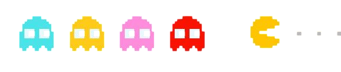

  

---
## About Me 
🎮 Player: Ash  
🧠 Class: AI/ML Explorer || Coffee-Powered Coder ☕  
📍 Level: B.Tech – Year 3  

---
## ⚔️ Skills Unlocked: 
• Python, C, HTML, CSS  
• Machine Learning (in progress…)  
• Problem Solving & Debugging  
• Sketching + Creativity Boost  

---
## 🧠 Brain Specs: 
• RAM: Depends on sleep  
• CPU: Overheats during exams🔥  
• Storage: verge of fullness  

---
## 🧩 Current Quests:
• Building real-world ML projects  
• Mastering algorithms  
• Creating something questionable (...maybe)  

---
## 🏆 Achievements: 
✅ Turned curiosity into code  
✅ Survived countless compiler errors  
✅ Broke 10 things while fixing 1  
✅ Still working 💪  

---
## 💡 Philosophy: 
if (life == hard) {  
tryAgain();  
}  

---
